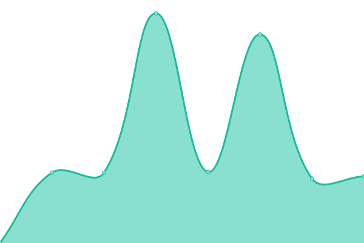

# [📈 Live Status](https://slallemand.github.io/upptime): <!--live status--> **🟧 Partial outage**

This repository contains the open-source uptime monitor and status page for [slallemand](https://slallemand.github.io/upptime), powered by [Upptime](https://github.com/upptime/upptime).

With [Upptime](https://upptime.js.org), you can get your own unlimited and free uptime monitor and status page, powered entirely by a GitHub repository. We use [Issues](https://github.com/slallemand/upptime/issues) as incident reports, [Actions](https://github.com/slallemand/upptime/actions) as uptime monitors, and [Pages](https://slallemand.github.io/upptime) for the status page.

<!--start: status pages-->
<!-- This summary is generated by Upptime (https://github.com/upptime/upptime) -->
<!-- Do not edit this manually, your changes will be overwritten -->

| URL                                                                    | Status  | History                                                                                                                               | Response Time                                                                                     | Uptime                                                                                                                                                                                                                                                           |
| ---------------------------------------------------------------------- | ------- | ------------------------------------------------------------------------------------------------------------------------------------- | ------------------------------------------------------------------------------------------------- | ---------------------------------------------------------------------------------------------------------------------------------------------------------------------------------------------------------------------------------------------------------------- |
| [Nextcloud](https://cloud.lallemand.fr)                                | 🟩 Up   | [nextcloud.yml](https://github.com/slallemand/upptime/commits/master/history/nextcloud.yml)                                           |  750ms                    |                                          |
| [Cormeilles](https://home.cormeilles.lallemand.fr)                     | 🟩 Up   | [cormeilles.yml](https://github.com/slallemand/upptime/commits/master/history/cormeilles.yml)                                         |  1160ms                  |                                        |
| [Dizy](https://home.dizy.lallemand.fr)                                 | 🟩 Up   | [dizy.yml](https://github.com/slallemand/upptime/commits/master/history/dizy.yml)                                                     |  10133ms                       |                                                     |
| [https://productmodelling.axa.com/](https://productmodelling.axa.com/) | 🟥 Down | [https-productmodelling-axa-com.yml](https://github.com/slallemand/upptime/commits/master/history/https-productmodelling-axa-com.yml) |  0ms |  |

<!--end: status pages-->

[**Visit our status website →**](https://slallemand.github.io/upptime)

## 📄 License

- Powered by: [Upptime](https://github.com/upptime/upptime)
- Code: [MIT](./LICENSE) © [slallemand](https://slallemand.github.io/upptime)
- Data in the `./history` directory: [Open Database License](https://opendatacommons.org/licenses/odbl/1-0/)
